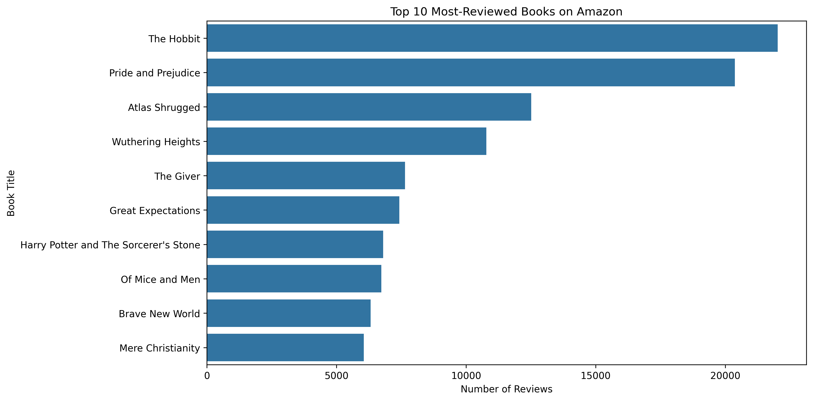
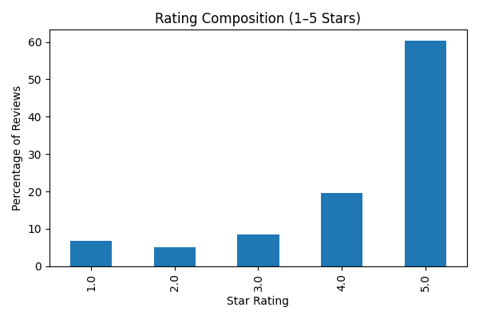
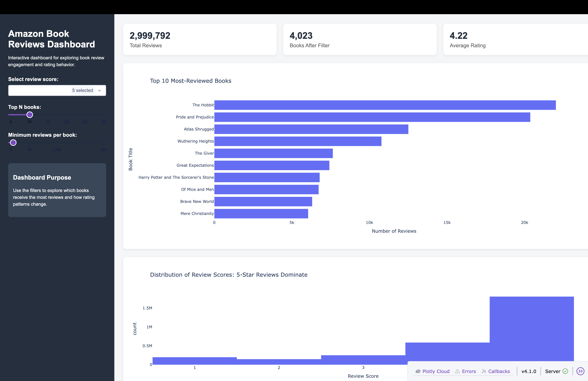
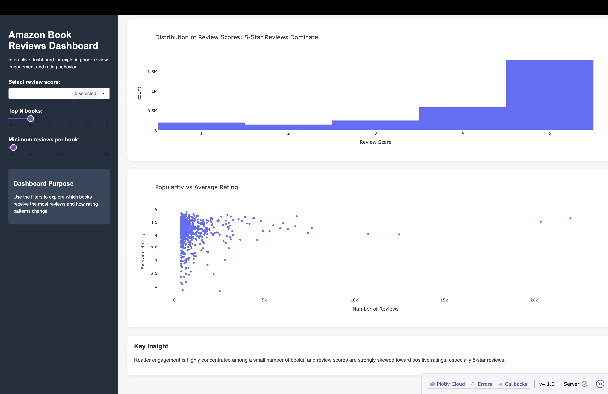

# The AmazonS – Amazon Books Reviews Project

# Team Members (Sprint changes)
- Vanshika
- Rupashi
- Siya
- Aaron Mundanilkunathil

# Dataset Description
We are using the Amazon Books Reviews Dataset from Kaggle. It includes book review text and summaries along with metadata such as ratings (scores), helpfulness information, user/profile details, and timestamps.
Source: https://www.kaggle.com/datasets/mohamedbakhet/amazon-books-reviews

## Project Assignment 3: Final Shine Component

For the final sprint, our team selected **Option B: Deeper / Additional Visualizations**.  
Each team member contributed one additional visualization to make the project more polished and easier to understand for an executive audience.

### Visualization 1: Top 10 Most-Reviewed Books

This visualization shows which books received the highest number of reviews in the Amazon Books Reviews dataset. It helps identify which titles had the strongest reader engagement and shows that review activity is concentrated among a small number of highly visible books.



**Notebook:** `notebooks/Project_Assignment_03_Final.ipynb`

**Key takeaway:** A few books, such as *The Hobbit* and *Pride and Prejudice*, received much higher review counts than most other titles. This suggests that reader engagement on Amazon is highly concentrated, which can affect visibility, trust, and purchasing decisions.

### Visualization 2: Average Rating by Popularity Bucket


### Visualization 3: Rating Composition by Star Level
This visualization shows the percentage distribution of 1-star to 5-star ratings across all Amazon book reviews.



**Key takeaway:**  
Most reviews are concentrated in the higher ratings (4–5 stars), indicating generally positive customer sentiment toward books on Amazon.

---

## Interactive Dashboard

We also added an interactive Plotly Dash dashboard to make the project more user-friendly. The dashboard allows users to explore Amazon book review patterns using filters and interactive charts.

The dashboard includes:

- KPI cards for total reviews, books after filtering, and average rating

- A review score dropdown

- A Top N books slider

- A minimum review count slider

- An interactive chart of the most-reviewed books

- An interactive rating distribution chart

- An interactive popularity vs. average rating chart

- A key insight summary box

### Dashboard Preview





---

## How to Run the Dashboard

The dataset is not included in this repository because it is too large.

1. Download the dataset from Kaggle:  

   https://www.kaggle.com/datasets/mohamedbakhet/amazon-books-reviews

2. Place `Books_rating.csv` in the main project folder, at the same level as `app.py`.

3. Install the required Python packages:

```bash

pip install -r requirements.txt

4. Run the dashboard:

python app.py

5. Open the dashboard in your browser:

http://127.0.0.1:8050/

# End Goal
Our end goal is to use this dataset to find patterns in ratings and review text, and turn the results into clear insights.
